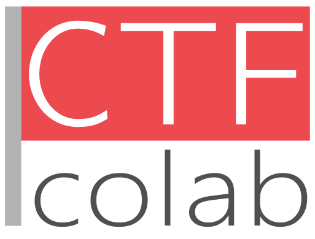
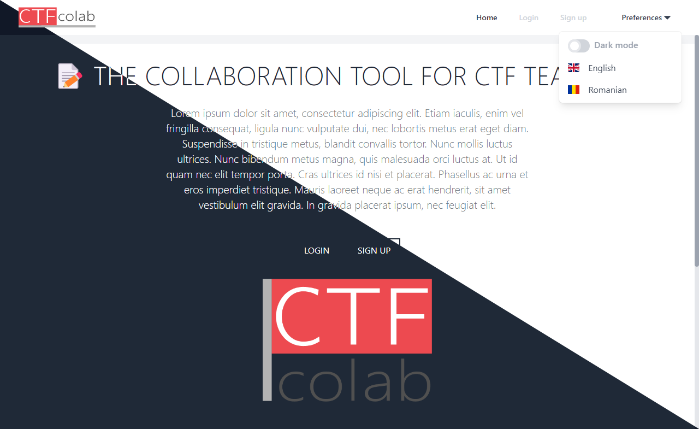

# CTFcolab

📝 A collaboration tool for CTF teams 🚩

Live demo: [https://ctfcolab.wtl.pw](https://ctfcolab.wtl.pw)

## Features

Backend:
* [3 Controllere (minim); Fiecare Metoda Crud, REST cu date din baza de date.](Controllers)
* [Cel puțin o relație între tabele din fiecare fel (One to One, Many to Many, One to
Many); Folosirea metodelor din Linq: GroupBy, Where; Folosirea Join si Include](DAL)
* [Autentificare + Roluri; Autorizare pe endpointuri în funcție de Roluri; Cel putin 2
Roluri: Admin, User](Authorization)
* [Sa se foloseasca repository pattern/unit of work](DAL)

React:
* [Mai multe pagini publice si private](ClientApp/src/App.tsx#L101)
* [Conectare api facut in .net](ClientApp/src/store)
* [Login, Register, User profile](ClientApp/src/components/pages)
* [Reset password (bonus 0,25)](ClientApp/src/components/pages/RecoverPassword.tsx)
* [Global state manager (redux, **mobX**, context api)](ClientApp/src/store/AuthStore.ts)
* [custom hooks (bonus 0,25)](ClientApp/src/components/layout/NavMenu.tsx#L62)
* [traduceri (bonus 0,25)](ClientApp/src/services)
